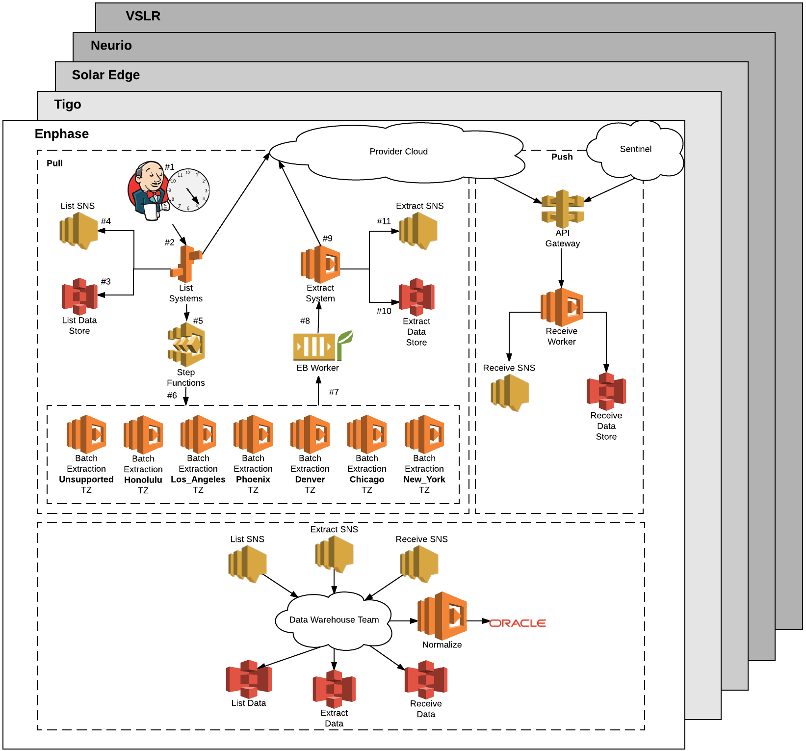

THIS IS A TEMPLATE. FIND & REPLACE ALL OCCURRENCES OF "TEMPLATE-BASIC" WITH YOUR PROJECT.
# TEMPLATE-BASIC

[](https://greenkeeper.io/)

<!-- Provide a description: What is the project for? What does it do? What is its purpose? -->
Provides ... for interacting with the sentinel devices. It also has a [gui](https://...) for setting the wifi credentials on a device.

<!-- What is the architecture of this project? Replace the included chart with your own projects chart capturing the components of the project architecture. -->


<!-- What is the basic flow of data? Replace the 'Pull Process' steps below and provider your projects list of steps to understand the flow through your architecture diagram. -->
### Pull Process
  1. Jenkins cron job is started at 5 PM MST for each provider to curl list with the given date.
  2. List elastic beanstalk server (EBS) receives the request to start extracting the list of systems from the provider.
  3. The List Service saves the result of the extraction to S3.
  4. The List Service emits an event to SNS.
  5. The List service triggers step functions to start.
  6. The step functions batch and schedule the systems for their appropriate timezones.
  7. Each providers timezoned systems are placed on a SQS queue to be consumed by the EBS extraction workers.
  8. The <provider> extraction worker only pulls off a certain number of messages to enforce throttling and calls the extraction lambda with a system to process.
  9. The extraction lambda throttles the number of calls it makes to the provider, making several calls to extract system information.
  10. The extracted information is saved to S3.
  11. The extracted event is emitted to SNS.
 
## Information

* Documentation <!-- Do you have docs other than this readme? Where are they? (swagger, etc) -->
  * [swagger](https://...)
  * [Google Docs](https://...)
* Lanes <!-- What lanes does this product have, e.g. dev/stage/prod/etc? If you can link to them. -->
  * [production](https://...)
  * [stage](https://...)
* Logs <!-- What logs are tracked? (loggly, google analytics, etc) What are links to view them? -->
  * [Loggly](http://...)
  * [Newrelic](http://...)
* Stack <!-- What technology does this application use? If you are using AWS, link to EC2 instances, logs, etc. What task runner (grunt/gulp/webpack)? What css handling (scss, stylus, cssinjs)? -->
  * [aws elastic beanstalk](https://...)
  * [hapijs](https://github.com/hapijs/hapi)
  * credstash
  * webpack - for the client
  * dependencies <!-- What dependencies do you have on other systems? (salesforce, kobol, auth, etc) -->
    * Auth
    * Provisioning 2.0 (lambdas)
* Sox Compliance <!-- Does this project require sox compliance for an extra level of security? -->
  * This project ***does not*** require sox compliance.
* Team <!-- Who are the primary engineers/developers, managers, customers, etc? -->
  * Aaron Stubbs/etc (Product Owner)
  * Justin Morris/Dan Crews/Nic Johnson/Jeff Brown (Engineering Manager) 
  * [Developers](https://github.com/VivintSolar/TEMPLATE-BASIC/graphs/contributors)

## Development

<!-- Explain how to get the project up and running for local development -->

```bash
git clone git@github.com:VivintSolar/TEMPLATE-BASIC.git
cd TEMPLATE-BASIC
npm install
```

* To start the api with nodemon run `npm run dev`.
* To start the client with hot-reload run `npm run start-client`
* For working with the client being served by hapi run the following:

```bash
npm run build
npm start
```

<!-- Is there any additional configuration that needs to happen? Adding AWS credentials? Lane specific config? -->

* Configuration
  * Done using credstash and credstash-loader

## Testing

<!-- What tests do you have? How do you run them? If automatic, when do they run? -->

The following node scripts and their descriptions

* `test` runs all unit, acceptance, and integration tests.
* `test:unit` runs the unit tests.
* `test:unit:watch` runs the unit tests with the watch flag min report and bails on the first failed test.
* `test:integration` runs the integration tests.
* `test:integration:watch` runs the integration tests with the watch flag min report and bails on the first failed test.
* `test:acceptance` runs the acceptance tests.
* `test:acceptance:watch` runs the acceptance tests with the watch flag min reporter and bails on the first failed test.
* `coverage` instruments the files before running the unit tests

After running coverage you can check run the report or check coverage using the nyc script

* `npm run nyc -- check-coverage` checks the coverage
* `npm run nyc -- report` displays the report of coverage

## Builds/Deployment

<!--
What is the process for deploying to each lane? (tag in github, manual jenkins build, etc)
Are there vesions? What versioning system do you follow? (semver, etc) How do you release/tag a version? (`npm version major|minor|patch`)
-->

* Builds are done using the [Jenkinsfile](./Jenkinsfile).
* [Jenkins](https://build2.vivintsolar.com/blue/organizations/jenkins/sentinel/activity?branch=master) automatically builds to sentinel.stage.vivintsolar.com on each merge to the master branch.
* It will then prompt to promote to on-deck.
* After promoting to on-deck it will prompt to swap urls.
